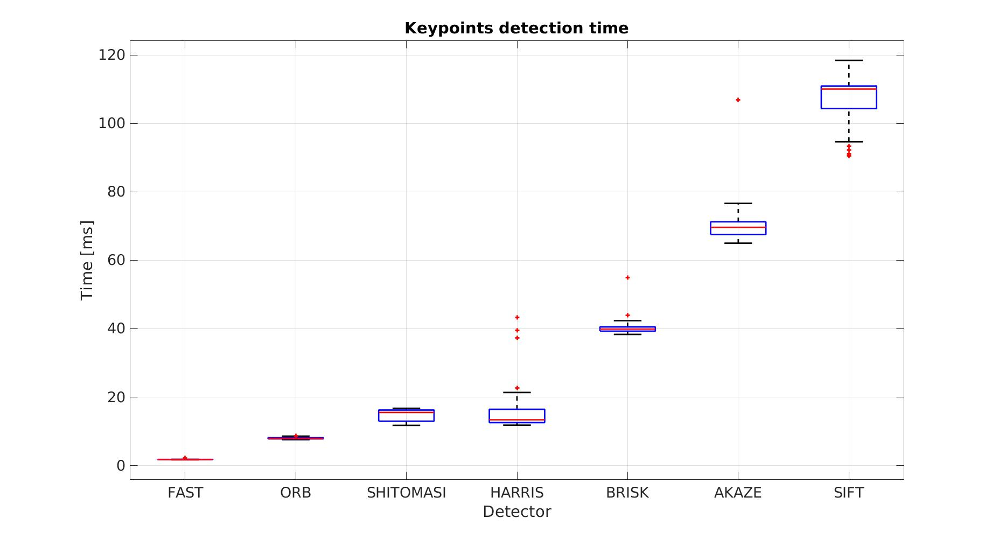
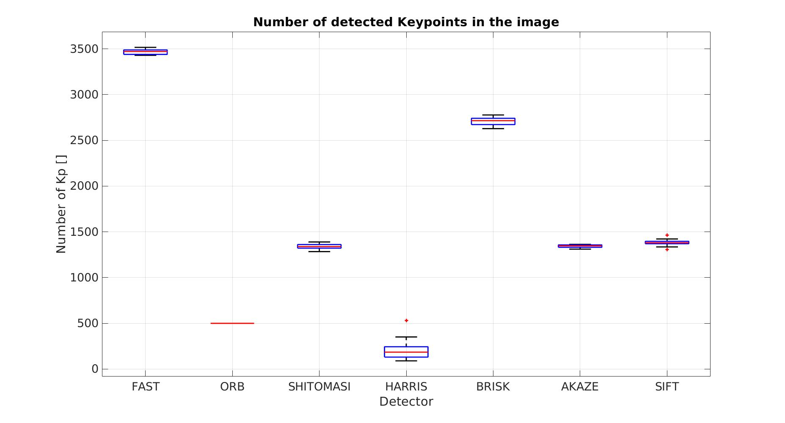
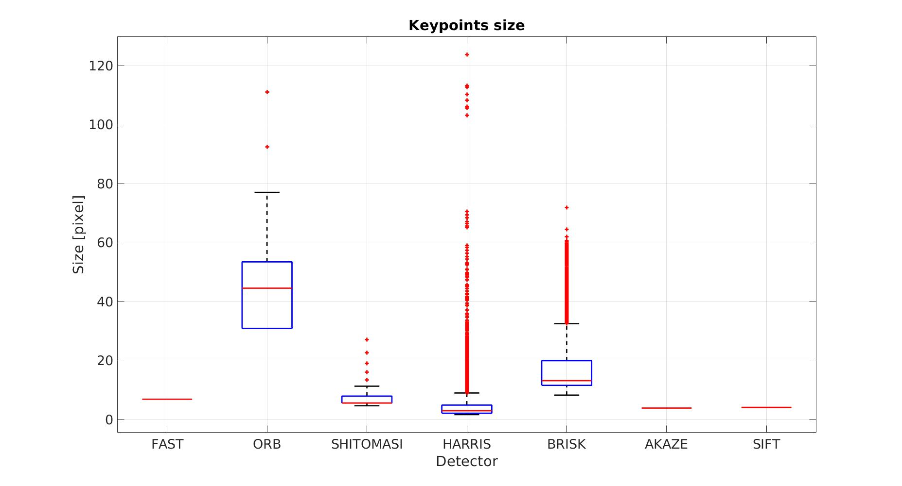
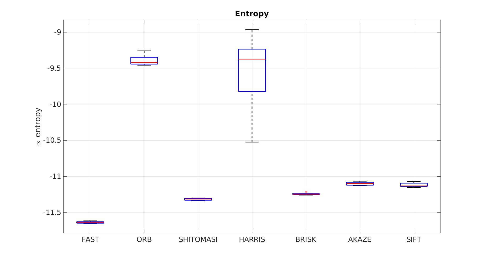
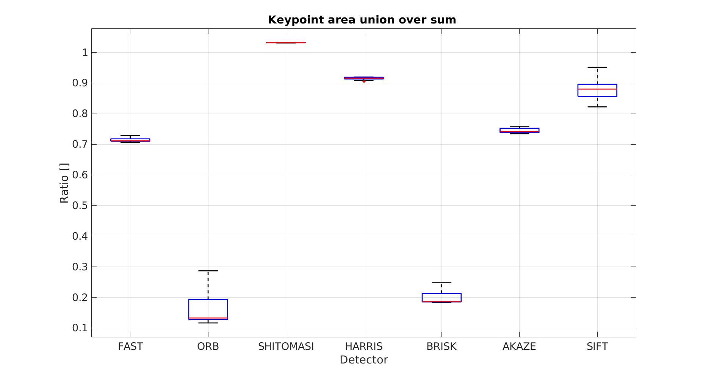
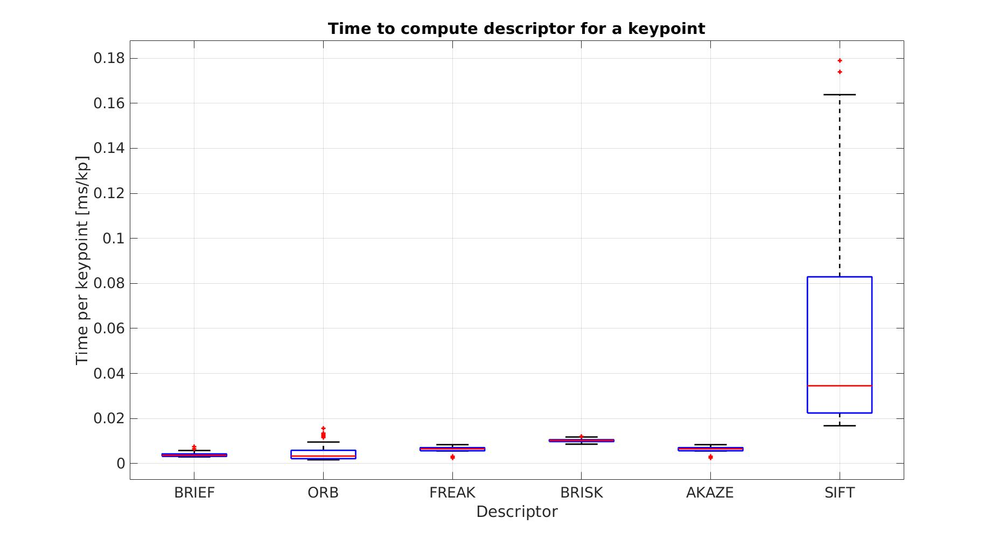
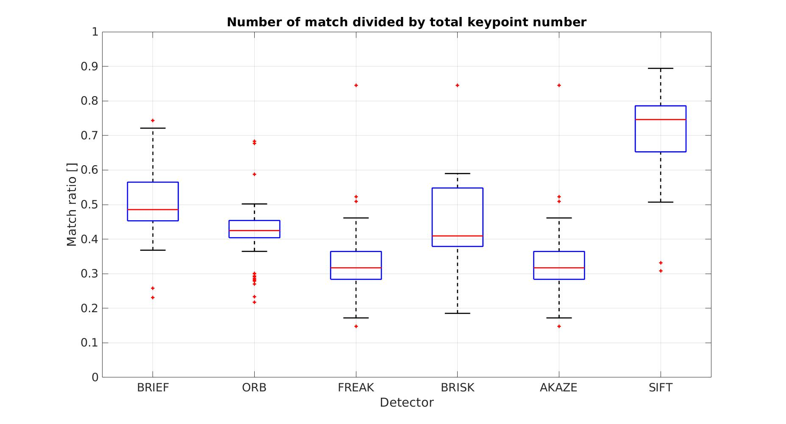
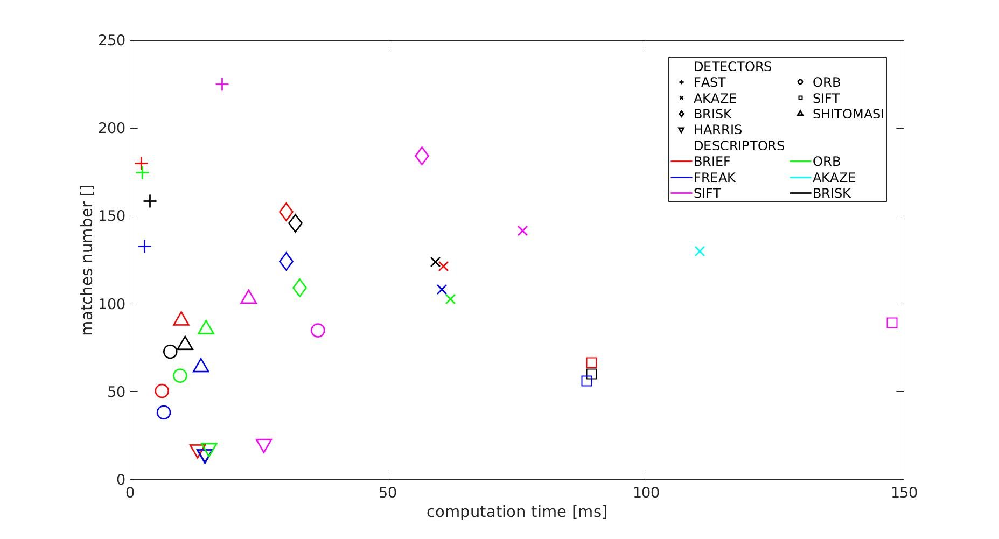

# Sensor Fusion Engineer Nanodegree
## 2D Feature Tracking Report
This report aims at finding the most appropriate key-point detector and descriptors to use to track key-points between images. In particular tracking the key-points will be leveraged in the next project to compute Time-to-Collision (TTC) from a monocular camera mounted on top of a vehicle in realtime. 

The result were obtained using the descriptor and detector implemented in OpenCV with their default values on a computer with a i7-4770K CPU @ 3.50GHz CPU and 8 Gb of RAM (no GPU was used).

In the first section an analysis of available key-point detectors is reported. At first an analysis of computation time and key-points size and spreadness is carried out on the entire image and then is particularized on a little area focused around the vehicle in the image center.
The second chapter focus on the descriptors again the analysis at first is carried out on the entire image and then is particularized on the central area.
The last section subsume the result of the previous section and add some final consideration that can be used to choose the more appropriate detector-descriptor combination depending on the application requirements.

## Keypoint Detectors
We analyzed the following set of detectors implemented in OpenCV 'FAST', 'ORB', 'AKAZE',  'SIFT', 'BRISK', 'SHITOMASI', 'HARRIS'. 

### Extraction Time
The first image report the box plot resuming the measured key-points computation time. Note that the detector initialization time is not considered since it is done only once at the beginning of the process.

The name FAST is properly given since FAST is the fastest detector requiring on average less than 2 ms to compute the keypoints on the 1242x375 image (as can be seen from the picture above). ORB detector is the second fastest detector requiring on average 8 ms and then we have Shitomasi detecor (15 ms), Harris (17 ms), Brisk(40 ms), Akaze (70 ms) and SIFT  (107 ms).

### Keypoints Number
Very roughly more keypoints we have and more redundant information we have and in principle a more robust tracking algorithm is possible.

As we can see in the picture FAST again is the detector in the first place detecting an average of about 3500 keypoints for each image. Brisk is the second best detector with respect to keypoints number with about 2800 keypoints and then Shitomasi, Akaze and Sift. The last 2 are ORB with 500 keypoints per image (note that for this detector the number of feature per image is a parameter) and Harris with about 200 keypoints per image.
As a remark we want again to stress that we used the default settings of the keypoints detector and changing them different result can be achieved and that not only the number but even the "quality" of keypoints should be considered. Disposing of a huge amount of keypoints that are not univocally determinate and that cannot be matched across images is less desirable than having only few keypoints but easily trackable across image.

### Size
The plot reported is the size of the keypoints.

We can see that, in contrary with the other detectors, FAST, AKAZE and SIFT work with fixed size keypoints. We can see that on average the ORB keypoints are the bigger while Shitomasi and Harris are the smaller, even if HARRIS present the highest size variability registering the smallest and the largest keypoint size value.
Potentially an high variability in keypoints size could be beneficial since it means that the detector is flexible to the patch dimension in the image.

### Spreadness
A important aspect to analyze is how well the keypoints are spread in the images. A parameter that could represent this is the entropy: the entropy is 0 in the perfectly ordered scene were all the keypoints are located in the same spot and will decrease more the keypoints are spread in the images. To convert the integral needed to compute the entropy in the discrete image case we use a base area of 10x10 pixels.

Across all the descriptor seems that FAST, SHITOMASI, BRISK, AKAZE and SIFT have better performance of ORB and HARRIS that seems to detect keypoints in cluster.
Having keypoints close one to the other could be interesting analyze the ration between the union of the area of interest of the keypoints divided by the sum of the area of interest of the keypoints: completely disjoint keypoints will produce a ratio of 1, instead completely overlapped region will produce a ration that tend to 0.

ORB have the lower ratio value (a high overlap of the keypoints influence area) since as shown before it presents clustered keypoints with an elevate size.
In contrast HARRIS, although the high entropy, presents a elevate ratio thanks to the flexible size of the keypoints.

## Keypoint Descriptors
We analyzed the following set of descriptors implemented in OpenCV 'BRIEF', 'ORB', 'FREAK', 'AKAZE', 'SIFT', 'BRISK'.

### Computation Time
In the following picture we report the per keypoint computation time of the descriptor.

We can see how all the descriptor have a similar computation time except for SIFT. This was somehow expected since SIFT feature are computationally expensive.

### Match Rate
In the following picture we report how many of the keypoint in the image are matched with the following image and more specific we report the ratio between matches found over the total keypoints number.

SIFT have the higher matching rate followed by BRIEF.
Note that this metric is only qualitative since it does not consider how many of the founded matches are correct. A manual labelling of the keypoint is required to access this value on the available data.

## Analysis focused on car region and TTC application
In this section we report the match number vs the computation time for each possible combination of descriptor/detector.
The shape of the marker stand for the detector and the color for the descriptor used.

Most of the detector/descriptors can compute the keypoints within less than 50 ms which is already much lower than the human reaction time (100-300 ms). 
Anyway in general faster the TTC is better the system can prevent accidents, therefore the minimum detection time is desirable. 
Given this solution using SIFT or AKAZE as detector can be discarded due to the high computation time and the technology should be selected among the remaining setups. Focusing on the top left part of the graphs FAST + BRIEF/ORB seems to be the more suited setup for TTC application, but FAST+SIFT could be also considered sacrificing computation time but gaining in match numbers.
This is only a preliminary analysis and is far from be exhaustive. A more in depth evaluation of the matching quality should be carried out that can change the ranking of the descriptors. We foresee that in addition to FAST other descriptor that could be competitive are BRISK and Shitomasi coupled with SIFT, BRIEF and ORB descriptors.

